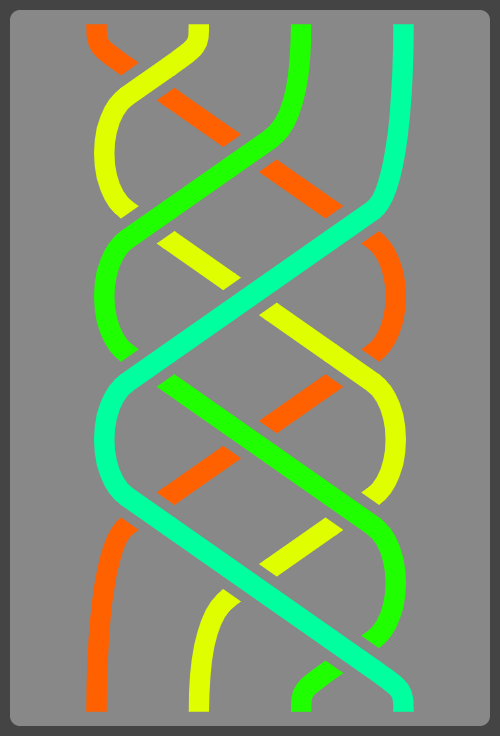

# Show Braid

Quick javascript hack to show braids. Braid words are drawn with the rightmost generator in the word at the bottom of the visualization. Positive generators are left-over-right and negative are right-over-left. (Though both of these things could be changed with a few careful edits in `Braid_redraw`.)

To use, pass a braid in the query string as a number of strands followed by a list of generators:
```
show-braid.html?4:1,2,1,3,2,1,-3,-2,-3,-1,-2,-3
```

If you don't specify the strand count it will be automatically inferred:
```
show-braid.html?1,-5
```

You can adjust how the braid looks by changing the constants near the top of `Braid_redraw`.

## Example

```
show-braid.html?4:1,2,1,3,2,1,-3,-2,-3,-1,-2,-3
```




## License

Public domain.
